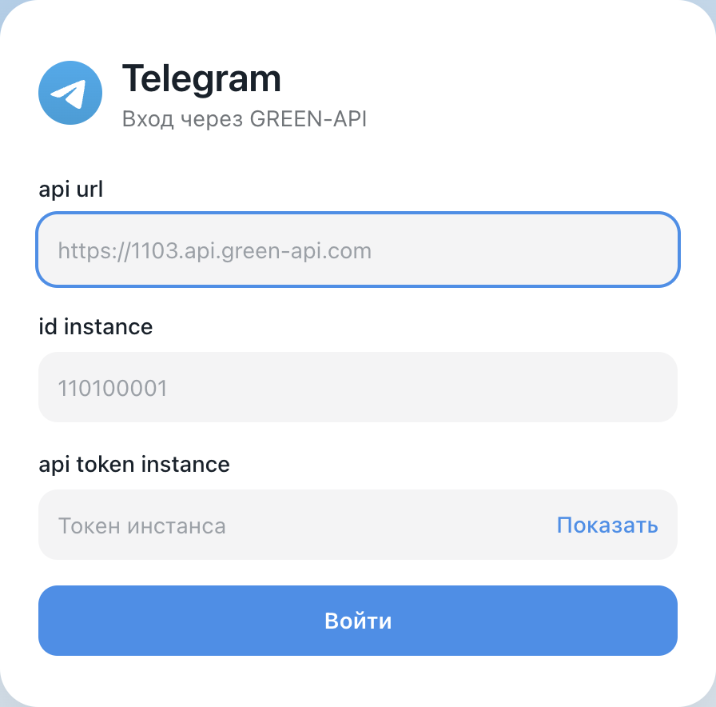
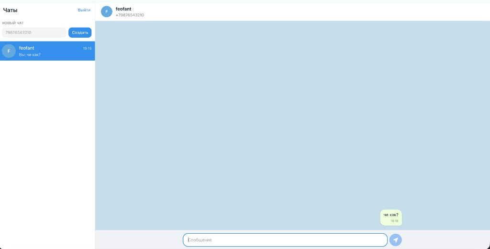

# Чат Telegram через GREEN-API

Текстовый чат: вход по данным инстанса, диалог по номеру телефона, отправка и приём сообщений.

## Демо

https://green-api-telegram.surge.sh/

## Как выглядит

Вход:



Переписка:



## Локальный запуск

```bash
npm install
npm run dev
```

Vite напечатает адрес, обычно http://localhost:5173.

Для входа нужны `api url`, `id instance` и `api token instance` из [кабинета GREEN-API](https://console.green-api.com). Инстанс должен быть авторизован в Telegram.

## Публикация

```bash
npm run deploy
```

Команда собирает проект и публикует его на https://green-api-telegram.surge.sh/. Нужен аккаунт [Surge](https://surge.sh/) и один раз выполненный `surge login`.
